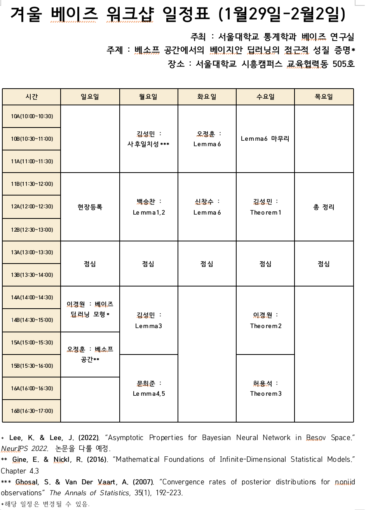

[Lee, K., & Lee, J. (2022). Asymptotic Properties for Bayesian Neural Network in Besov Space](https://arxiv.org/abs/2206.00241) 논문의 정리들을 증명했습니다.

* 날짜: 2023년 1월 29일 ~ 2월 2일
* 장소: 서울대학교 시흥캠퍼스

## 일정표

자세한 내용은 https://wiki.snubayes.org/lab/workshop/2023-winter-APforBNNinBS 에서 확인하실 수 있습니다.